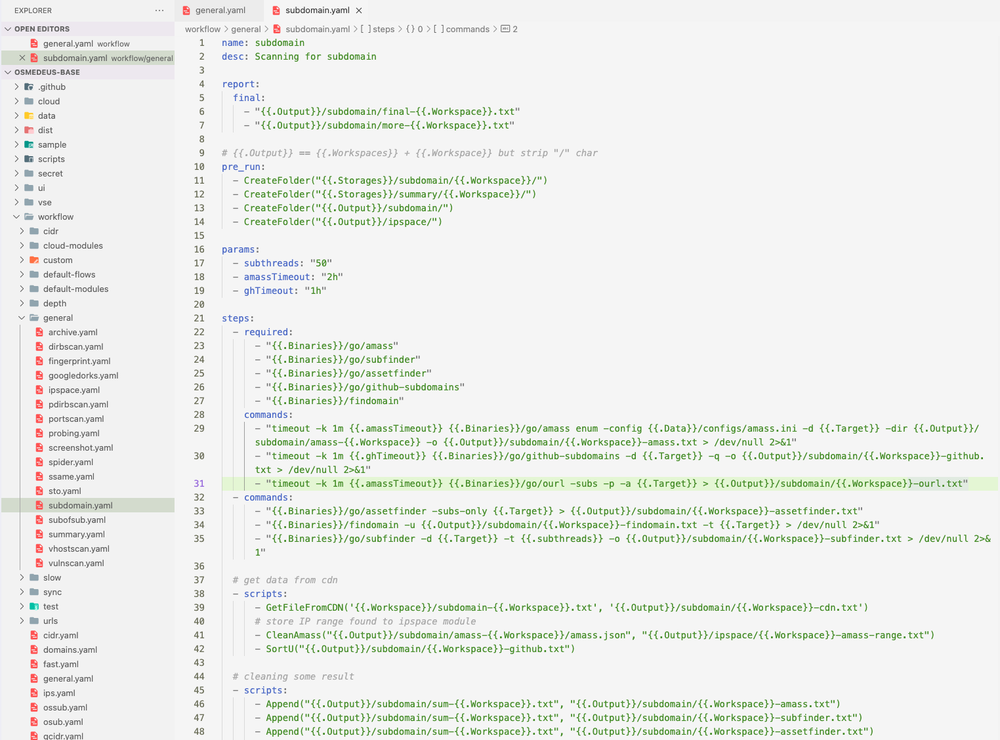
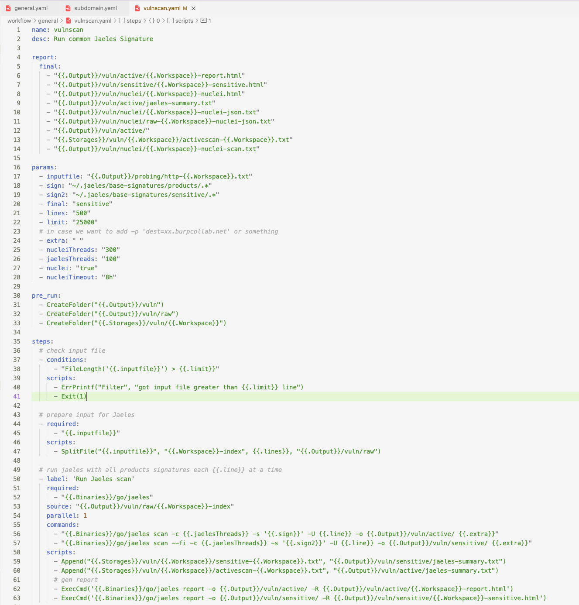

# :brain: Understand the workflow

!!! Warning "All Workflow files are YAML-based. Make sure you follow the YAML syntax otherwise, it would work"

{ loading=lazy }

- **Module** contains detail of multiple step.
- **Flow** contains multiple module and also define order how to run these modules.
- **Step** is smallest part of the Osmedeus routine.

## Flow

```yaml
name: general
desc: run normal routine
type: general # this is a folder name that will contains module file
validator: domain # validate the input provide from -t option

routines:
  - modules:
      - subdomain
  - modules:
      - probing
  - modules:
      - ssame
  - modules:
      - screenshot
  - modules: # these module will be run in parallel
      - fingerprint
      - spider
      - sto
  - modules:  # these module will be run in parallel
      - archive
      - ipspace
  - modules:
      - vulnscan
  - modules:
      - vhostscan
  - modules:
      - portscan
  - modules:
      - pdirbscan
  - modules:
      - dirbscan
  # push final result again
  - modules:
      - summary

```

## Module
{ loading=lazy }

{ loading=lazy }

## Step


```yaml
steps: # all step run in serial

 # variation 1 
  - required: # Check if all the files exist or the step will not run
      - filename-1-here.txt
      - filename-2-here.txt

    conditions: # Boolean conditions check with built-in scripts
      - "FileLength('filename.txt') > 1000"

    commands: # unix command and it will be run in parallel
      - "unix command 1 here"
      - "unix command 2 here"
    scripts:
      - SortU("filename-here.txt")
      - TeleMessByFile("#dirb", "beautify-{{.Workspace}}.txt")

    ## only run if conditions is false
    rcommands: # run in parallel
      - "unix command 1 here"
      - "unix command 2 here"
    rscripts:
      - ErrPrintf("Filter", "Got input file greater than 1000 line")
      - Exit(1)

 #########################
 
 # variation 2 that will run the step but with input is each like of 'source' section
  - source: "{{.inputfile}}" # source file to loop through
    threads: '{{.dirbThreads}}'
    commands:
      - "{{.Binaries}}/go/ffuf-mod -H 'X-Forwarded-For: 127.0.0.1' -t {{.fthreads}} -recursion-depth {{.recursion}} -D -e 'asp,aspx,php,html,htm,jsp,cgi' -timeout 15 -get-hash -ac -s -fc '429,404,400' -of json -o {{.Output}}/directory/raw-{{._id_}}.json -u '{{.line}}/FUZZ' -w {{.wordlists}}:FUZZ"
    scripts:
      - SortU("{{.Storages}}/paths/{{.Workspace}}/paths-{{.Workspace}}.csv")
```

## Default workflow

```text
$ osmedeus scan -f [flow-name] -t example.com

   general - run normal routine (default)
      cidr - Scan for CIDR File
   domains - run normal routine but without subdomain scan
      fast - run normal routine but for hts with low resources
       ips - Scan for list of IPs
     ossub - run slow routine with only subdomain enumeration
   general - run general routine with only subdomain enumeration
     pcidr - Scan for single CIDR with slow mode
     qcidr - Scan for CIDR File but for quick port
     quick - run normal routine
     scidr - Scan for single CIDR
      slow - run slow routine
     scidr - Scan for single CIDR
      sync - Sync result based on git
      urls - Scan for List of URLs
      vuln - run fast routine with vuln scan

```